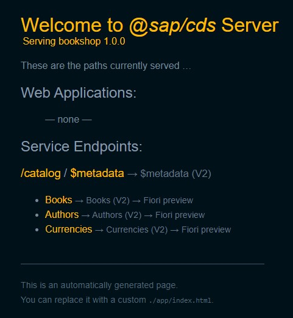
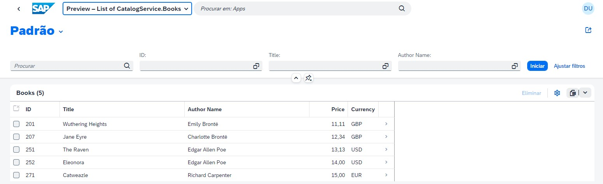
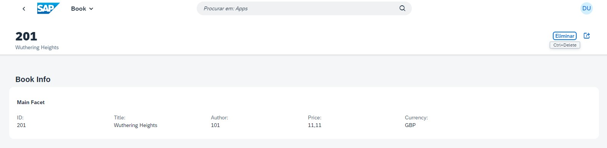

# Começando

Primeiro projeto SAP CAP.

Ele contém essas pastas e arquivos, seguindo nosso layout de projeto recomendado:

Arquivo ou Pasta | Propósito
---------|----------
`app/` | o conteúdo para front-end de UI está aqui
`db/` | seus modelos de domínio e dados vão aqui
`srv/` | seus modelos de serviço e código acesse aqui
`package.json` | metadados e configuração do projeto
`readme.md` | este é o guia do passo a passo

## Passo a passo

1. Gere um novo projeto CAP.

    `cds init bookshop`

2. Crie um **db/schema.cds**. Aqui, vamos usar um modelo para livraria.

~~~javascript
using { Currency, managed, sap } from '@sap/cds/common';

namespace sap.cap.bookshop;

entity Books : managed {
    key ID       : Integer               @title : 'ID';
        title    : localized String(111) @title : 'Title';
        descr    : localized String(1111)@title : 'Description';
        author   : Association to Authors @title : 'Author';
        stock    : Integer               @title : 'Stock';
        price    : Decimal(9, 2)         @title : 'Price';
        currency : Currency              @title : 'Currency';
}

entity Authors : managed {
    key ID           : Integer     @title : 'Author ID';
        name         : String(111) @title : 'Author Name';
        dateOfBirth  : Date        @title : 'Date of Birth';
        dateOfDeath  : Date        @title : 'Date of Death';
        placeOfBirth : String      @title : 'Place of Birth';
        placeOfDeath : String      @title : 'Place of Death';
        books        : Association to many Books on books.author = $self;
}
~~~

3. Criar **srv/cat-service.cds**
~~~javascript

using { sap.cap.bookshop as my } from '../db/schema';

service CatalogService {
    entity Books as projection on my.Books
    entity Authors as projection on my.Authors
}

~~~

4. Agora adicione a definição do serviço, adicionando as anotações do UI para **srv/cat-service.cds**.

~~~javascript

annotate CatalogService.Books with @(
    UI: {
        HeaderInfo: {
            TypeName: 'Book',
            TypeNamePlural: 'Books',
            Title: { Value: ID },
            Description: { Value: title }
        },
        SelectionFields: [ ID, title, author.name ],
        LineItem: [
            { Value: ID },
            { Value: title },
            { Value: author.name },
            { Value: price },
            { Value: currency_code }               
        ],
        Facets: [
            {
                $Type: 'UI.CollectionFacet',
                Label: 'Book Info',
                Facets: [
                    {$Type: 'UI.ReferenceFacet', Target: '@UI.FieldGroup#Main', Label: 'Main Facet'}
                ]
            }
        ],        
        FieldGroup#Main: {
            Data: [
                { Value: ID },
                { Value: title },
                { Value: author_ID },
                { Value: price },
                { Value: currency_code }               
            ]
        }
    }
);

~~~
5. Adicione dados para [db/data/Authors.csv](db/data/SapFioriDev.bookshop-Authors.csv) que está vazio.

6. Adicione dados para [db/data/Books.csv](db/data/SapFioriDev.bookshop-Books.csv) que está vazio.

7. Abra o terminal e execute `cds watch`

## Para saber mais

Saiba mais em: https://cap.cloud.sap/docs/get-started/.
